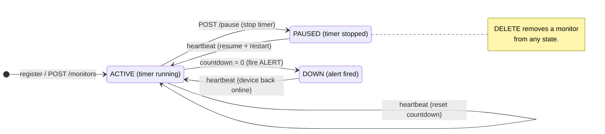
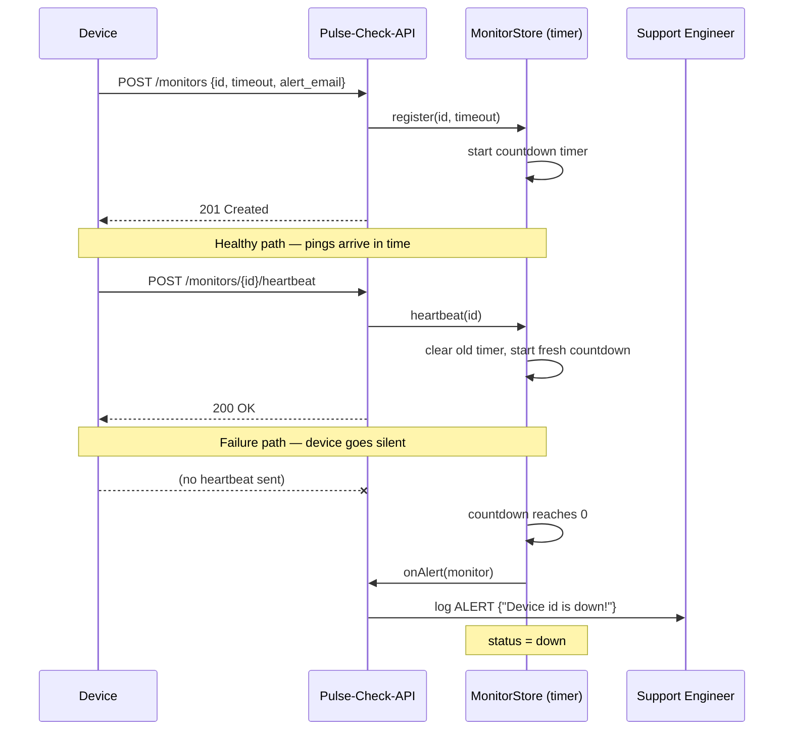

# Pulse-Check-API — "Watchdog" Sentinel

A **Dead Man's Switch** API for *CritMon Servers Inc.* Remote devices (solar farms, weather stations) register a monitor with a countdown timer and must "ping" before it runs out. If a device goes silent, the timer expires and the system **automatically fires an alert** so a human no longer has to read logs to discover an outage.

> **The core idea:** a Dead Man's Switch triggers an action when *nothing* happens. We model "nothing happening" with a timer. Every heartbeat cancels the pending timer and schedules a fresh one. If a heartbeat never arrives, the timer is never cancelled so it fires.

---

## Table of Contents
1. [Architecture & Logic Flow](#1-architecture--logic-flow)
2. [Setup Instructions](#2-setup-instructions)
3. [API Documentation](#3-api-documentation)
4. [The Developer's Choice](#4-the-developers-choice)
5. [Design Decisions & Trade-offs](#5-design-decisions--trade-offs)
6. [Testing](#6-testing)
7. [Project Structure](#7-project-structure)

---

## 1. Architecture & Logic Flow

### Component overview

The service is split into three small modules with a single responsibility each:

| Module | Responsibility |
| --- | --- |
| `src/server.js` | **HTTP layer.** Parses & validates requests, calls the store, shapes JSON responses. |
| `src/monitorStore.js` | **The brain.** Owns monitor state and every countdown timer. |
| `src/alerts.js` | **Notification.** Decides *how* an alert is delivered (here: a structured console log). |

This separation means the timing logic can be tested with zero HTTP and the alert channel can be swapped (email/webhook) without touching the timers.

### State diagram — the life of a monitor

A monitor lives in one of three states. Heartbeats and pauses move it between them.



### Sequence diagram — heartbeat vs. failure

This shows the two outcomes side by side: a healthy device that keeps pinging, and a device that goes silent and triggers the alert.



---

## 2. Setup Instructions

**Requirements:** Node.js 18+ (developed and tested on Node 22).

```bash
# 1. Install dependencies (just Express)
npm install

# 2. Start the server
npm start
# -> Pulse-Check-API listening on http://localhost:3000

# (optional) auto-restart on file changes during development
npm run dev

# (optional) run the test suite
npm test
```

The server listens on port `3000` by default. Override it with the `PORT` environment variable:

```bash
PORT=8080 npm start
```

---

## 3. API Documentation

Base URL: `http://localhost:3000`

| Method | Endpoint | Purpose |
| --- | --- | --- |
| `POST` | `/monitors` | Register a monitor and start its countdown |
| `POST` | `/monitors/:id/heartbeat` | Reset the countdown (also un-pauses / revives) |
| `POST` | `/monitors/:id/pause` | Pause the countdown ("Snooze") |
| `GET` | `/monitors` | List every monitor and its live status |
| `GET` | `/monitors/:id` | Get one monitor with remaining time |
| `DELETE` | `/monitors/:id` | Remove a monitor |
| `GET` | `/health` | Service health check |

### `POST /monitors` — Register

**Request body**
```json
{ "id": "device-123", "timeout": 60, "alert_email": "admin@critmon.com" }
```
`alert_email` is optional. `timeout` is in **seconds** and must be a positive number.

**Example**
```bash
curl -X POST http://localhost:3000/monitors \
  -H "Content-Type: application/json" \
  -d '{"id":"device-123","timeout":60,"alert_email":"admin@critmon.com"}'
```

**`201 Created`**
```json
{
  "message": "Monitor \"device-123\" created. Countdown started for 60s.",
  "monitor": {
    "id": "device-123",
    "status": "active",
    "timeoutSeconds": 60,
    "alertEmail": "admin@critmon.com",
    "remainingSeconds": 60,
    "createdAt": "2026-06-11T00:00:00.000Z",
    "lastHeartbeat": null,
    "expiresAt": "2026-06-11T00:01:00.000Z"
  }
}
```
Other responses: `400` (invalid input), `409` (id already exists).

### `POST /monitors/:id/heartbeat` — Reset

```bash
curl -X POST http://localhost:3000/monitors/device-123/heartbeat
```
**`200 OK`** — countdown restarted. Returns the updated monitor.
**`404 Not Found`** — unknown id.

### `POST /monitors/:id/pause` — Snooze

```bash
curl -X POST http://localhost:3000/monitors/device-123/pause
```
**`200 OK`** — timer stopped; no alert can fire. Send a heartbeat to resume.
**`404 Not Found`** — unknown id.

### `GET /monitors` and `GET /monitors/:id` — Observability

```bash
curl http://localhost:3000/monitors
curl http://localhost:3000/monitors/device-123
```
Returns the monitor(s) including a live `remainingSeconds` countdown for active monitors (`null` when paused or down).

### `DELETE /monitors/:id`

```bash
curl -X DELETE http://localhost:3000/monitors/device-123
```
**`204 No Content`** on success, `404` if unknown.

### The Alert (failure state)

When an active monitor's countdown hits zero, the server logs the exact payload required by the brief and marks the monitor `down`:
```json
{"ALERT": "Device device-123 is down!", "time": "2026-06-11T00:01:00.000Z"}
```

---

## 4. The Developer's Choice

**Feature added: Observability endpoints — `GET /monitors` and `GET /monitors/:id` with a live `remainingSeconds` countdown.**

**Why.** The brief gives you ways to *write* state (register, heartbeat, pause) but no way to *read* the current state. For a monitoring product that is a serious gap: the support engineer in User Story 3 has no dashboard. They cannot answer the most basic operational questions,*Which devices are currently down? Which are paused for maintenance? Which one is about to expire?* without these read endpoints. A monitoring system you cannot query is effectively blind.

Adding `GET` endpoints turns the service from a black box into something operable. The `remainingSeconds` field is computed on the fly from each monitor's `expiresAt`, so the answer is always live rather than a stale snapshot. These two endpoints are what a real status dashboard or an on-call engineer would poll.

*(I deliberately scoped this to the single feature the brief asks for. A `/health` check and a `DELETE` endpoint are also included as standard hygiene, but the observability read API is the headline addition.)*

---

## 5. Design Decisions & Trade-offs

These are the choices I made and would defend:

- **In-memory state (a `Map`).** The brief describes stateful timers, not durable storage. A `Map` gives O(1) lookup by device id and keeps the solution dependency-light and easy to run. **Trade-off:** state is lost on restart (see *Limitations*).
- **One `setTimeout` per monitor.** This is the most direct model of a countdown and makes "reset" a simple `clearTimeout` + new `setTimeout`. **Alternative considered:** a single periodic loop scanning all monitors. That scales to huge numbers of monitors but adds polling latency and complexity; per-monitor timers are clearer and correct for this scale.
- **Heartbeat revives `down` and `paused` monitors.** The brief only specifies the not-expired case. I chose to let any heartbeat bring a monitor back to `active`, because in reality a heartbeat means the device is alive again and monitoring should resume.
- **Re-registering an existing id returns `409 Conflict`** rather than silently resetting — creating a resource that already exists is a conflict; resetting is what `heartbeat` is for.
- **Dependency injection for alerts.** The store receives an `onAlert` callback instead of importing the alert code itself, so the notification channel can change (email, webhook) without touching timing logic, and tests can pass a fake.
- **`createApp()` factory with a `require.main` guard.** Lets tests import the app without opening a port, and lets `npm start` run the server directly.

### Limitations / future work
- **Persistence:** monitors live in memory, so a restart loses them. A production version would persist state (e.g. Redis/Postgres) and rebuild timers on boot.
- **Single instance:** in-process timers don't span multiple servers. A horizontally-scaled deployment would move timing to a shared store or a scheduler.
- **Delivery:** alerts are logged. The `alerts.js` module is structured so a real email/webhook call slots straight in.

---

## 6. Testing

```bash
npm test
```
The suite (`test/monitorStore.test.js`) uses Node's built-in test runner (no extra dependencies) and covers the core behaviours: registration, duplicate rejection, expiry firing an alert, heartbeat resetting the countdown, pause suppressing the alert, un-pausing, reviving a down monitor, and deletion. Timeouts use fractions of a second so the suite finishes in well under a second.

---

## 7. Project Structure

```
Pulse-Check-API/
├── src/
│   ├── server.js        # HTTP layer: routes, validation, JSON shaping
│   ├── monitorStore.js  # Core state + countdown-timer logic
│   └── alerts.js        # Alert delivery (console log; pluggable)
├── test/
│   └── monitorStore.test.js
├── package.json
├── .gitignore
└── README.md
```
